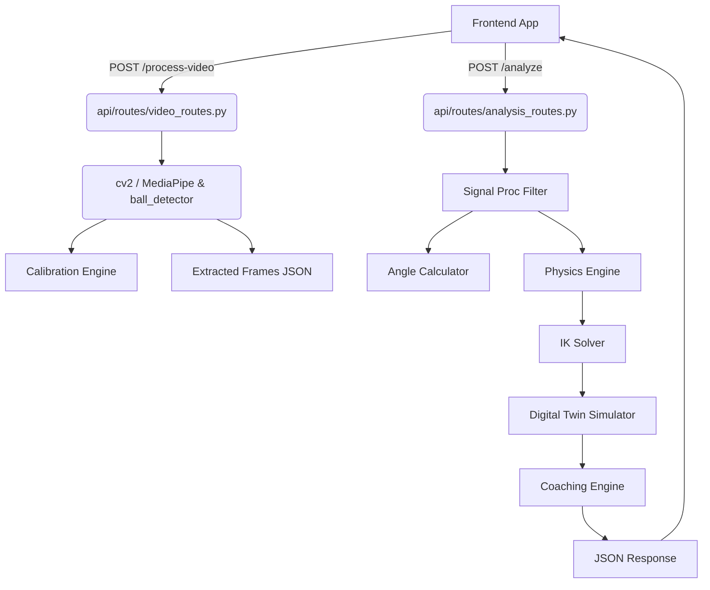

# 📚 BACKEND MASTER GUIDE - PenaltyIQ

Welcome to the **PenaltyIQ Backend Master Guide**. This document is designed to act as your complete handbook to understanding, maintaining, and scaling the backend architecture of PenaltyIQ. Whether you are a newly onboarded junior developer or a senior architect looking to extend the system, this guide explores everything from top to bottom.

---

## 1. 🔍 High-Level Overview

**What does this backend do?**  
The PenaltyIQ backend is a powerful **Computer Vision & Biomechanics API** for analyzing football (soccer) penalty kicks. It takes raw video footage of a penalty kick, extracts the human pose points and the ball position frame-by-frame, and reverse-engineers the physics and body mechanics using complex math. 

**Main purpose of the system:**  
To provide instant, professional-level coaching feedback. It estimates how fast the ball was kicked ($v_{0}$), the angle of the kick, joint angles (hip flexions, knee bend, etc.), and predicts if the ball hit the target zone using a **Digital Twin** simulation. It then tells the player what body parts they need to adjust to improve the shot.

**Real-world use case:**  
A player records themselves taking a penalty kick on a mobile app (Flutter frontend). The video is uploaded to the backend, which processes it behind the scenes, and replies with a summary report: "Ball speed: 95 km/h, Target Hit. Tip: Lean forward more over the ball."

**Type of architecture:**  
The backend is built around a **Modular Processing Pipeline** using FastAPI. It operates on a **Stateless / Functional approach** where requests supply the data (frames and coordinates), and the system returns computed analysis. There is currently no persistent database tightly coupled to the core logic, making it highly modular and stateless.

---

## 2. 🏗 System Architecture (VERY IMPORTANT)

### The Layers

The system follows a separated architecture:
1. **API Layer (`api/routes` & `api/schemas`):** Handles incoming HTTP requests, input validation via Pydantic, and returns JSON responses.
2. **Orchestration Layer (`api/routes/analysis_routes.py`):** Strings together the core engines in a specific order (Signal Processing $\rightarrow$ Physics $\rightarrow$ Inverse Kinematics $\rightarrow$ Digital Twin $\rightarrow$ Coaching). 
3. **Core Engine Layer (`core/`):** Contains the heavy mathematical and computer vision lifting. Completely decoupled from HTTP components. Data in $\rightarrow$ Data out.
4. **Data Models / Constants (`constants/`):** Defines the fixed biological limits, FIFA dimension standards, and priors for the physics math.

### Data Flow from Request to Response

1. **Video Upload:** The Flutter client POSTs a video to `/api/v1/process-video`. 
2. **Extraction:** The backend's `PoseEstimator` and `BallDetector` run across the video, extracting $\rightarrow$ Landmarks (body joints) + Ball Pixel Positions.
3. **Calibration:** A subset of frames (like a T-pose) are passed to the `Calibration Pipeline` to understand how many pixels equal 1 meter. 
4. **Analysis Pipeline:** The extracted coordinates are sent to `/analyze`:
    - *Signal Processing:* Cleans jumping pixels using a Butterworth filter.
    - *Angle Calculator:* Converts dots to human limb angles.
    - *Physics Engine:* Solves the 3D projectile path of the ball.
    - *IK Solver (Inverse Kinematics):* Re-positions joints to verify biomechanics.
    - *Digital Twin:* Runs the simulated ball to see where it lands on a virtual goal.
    - *Coaching Engine:* Compares target vs actual angles and generates natural language tips.
5. **Response:** A massive structured JSON is sent back to the frontend containing score metrics, angles, and feedback.

### Architecture Diagram



---

## 3. 📁 Project Structure Breakdown

### ROOT DIRECTORY
* `main.py`: The entry point for the FastAPI server. Registers routers and middlewares.
* `Dockerfile`: Container definition to package and run this application anywhere.
* `requirements.txt`: Python package dependencies (FastAPI, OpenCV, NumPy, MediaPipe).

### `api/`
Handles the external interface.
* `routes/`: Contains controllers for HTTP endpoints (`video_routes.py`, `analysis_routes.py`, `calibration_routes.py`). 
* `schemas/`: Pydantic models. They enforce that the JSON payload has the correct data types before it hits our logic.

### `core/`
This is the **brain**. 
* `angle_calculator.py`: Uses dot products to compute relative limb angles from X/Y coordinates.
* `ball_detector.py`: Uses OpenCV (HoughCircles) to locate the ball in a frame.
* `calibration.py`: Solves pixel-to-meter scales based on known player height or ball diameters.
* `confidence.py`: Analyzes the quality of tracking (visibility, frame drops) to yield a confidence/quality score.
* `digital_twin.py`: Simulates the kick trajectory using air resistance constants to hit a virtual goal line.
* `ik_solver.py`: Inverse Kinematics. It tries to map out joint angles matching physical limitations. 
* `physics_engine.py`: Solves classical mechanics for initial velocity and launch angle.
* `pose_estimator.py`: Integrates MediaPipe to extract human skeleton points.
* `signal_proc.py`: Butterworth low-pass filter logic to smooth out jittery frame data.
* `visualizer.py`: Draws skeleton overlays over mp4 video for visual debugging.

### `constants/`
* `fifa_constants.py`: Fixed goal height/width and ball diameters.
* `ik_priors.py` & `rom_limits.py`: Constraints on human joints (Range of Motion, meaning a knee can't bend backwards).

---

## 4. ⚙️ Core Logic Deep Dive

Let's do a step-by-step walkthrough of what happens when `/analyze` is called in `analysis_routes.py`.

1. **Extraction (Landmarks):** Iterates over the frames to collect X and Y arrays for each key body point (`extract_landmark_trajectories`).
2. **Signal Filtering:** Applies a 2nd-order **Butterworth Low-Pass Filter** (`filter_landmark_trajectory`). Video keypoints jitter. The filter creates a smooth curve over time, so velocity/acceleration derivatives don't spike insanely due to a slightly misplaced pixel. Needs at least 15 frames.
3. **Angle Extraction:** `compute_joint_angles_from_filtered_landmarks` uses 3 points to build 2 vectors, running `arccos(dot(u,v))` to get the flexions.
4. **Physics:** `extract_ball_positions` gathers the ball post-contact. `run_physics_pipeline` takes the X/Y deltas of the ball over `dt` (time frames), fits a curve, and extracts the tangent derivative at $t=0$ to get initial velocity ($v_0$) and angle ($\theta$).
5. **IK Solver:** Takes the launch metrics, and using Sequential Least SQuares Programming (SLSQP), attempts to find the "ideal" body joint angles required to efficiently reach the measured ball velocity.
6. **Digital Twin:** Extrapolates the trajectory factoring in air resistance. If the ball X,Y at $Z=GoalLine$ falls within standard FIFA goalposts $\implies$ Target Hit!
7. **Coaching Engine:** Compares the *Actual angles* to the *IK target angles*. It has thresholds (like `delta > 10 degrees`). If a delta is large, it throws a feedback tag: _"You leaned backward by X degrees too much."_

---

## 5. 🔌 API Documentation

### 1) POST `/api/v1/process-video`
* **Purpose:** Uploads raw video, extracts tracking data.
* **Content-Type:** `multipart/form-data`
* **Request:** 
  * `video` (file, MP4/MOV)
  * `session_id` (string)
  * `goal_zone` (string)
  * `mode` (string)
* **Response `200 OK`:** A giant JSON with scaled `analysis_frames` and `calibration` metrics. 

### 2) POST `/api/v1/calibrate`
* **Purpose:** Uses specific T-pose frames to lock in a pixel-to-meter reference.
* **Request Body:** JSON matching `CalibrationRequest` Schema.
* **Response `200 OK`:** Returns `status = LOCKED` and the computed segment lengths.

### 3) POST `/api/v1/analyze`
* **Purpose:** The real heavy lifter. Runs the data through physics & IK solvers.
* **Request Body:** JSON `AnalysisRequest`. Requires frames and calibration references.
* **Response `200 OK`:** 
  ```json
  {
     "session_id": "xxx",
     "physics": { "v0_measured_ms": 25.4, "theta_v_deg": 14.5 ... },
     "ik_result": { ... },
     "coaching_feedback": [
        { "cue": "Lean forward", "status": "NEEDS_WORK" ... }
     ]
  }
  ```

---

## 6. 🧠 Data Flow Story

Trace a real request: User $\rightarrow$ Frontend $\rightarrow$ Backend $\rightarrow$ Response.

1. **User** places the camera on a tripod, hits record on the **Flutter App**, does a T-pose, and takes a penalty kick.
2. The phone uploads the `.mp4` file as a multipart request to the **Backend (`/api/v1/process-video`)**. 
3. Fast API writes the bytes to a temp file on the server disk.
4. **MediaPipe** (Google's ML tool) scans the video frame-by-frame and spits out arrays of 33 body points. 
5. Simultaneously, **HoughCircles** scans to detect a round white sphere (the ball).
6. The backend stitches these pixel grids into a JSON payload and hands it back to the Frontend. 
7. The **Frontend** goes "_Cool, I have the data!_" and forwards it to the `/analyze` route.
8. The raw pixels are converted to **metric distances**. The joints are smoothed. The angles are computed. The physics equations run over the ball's movement to estimate it was shot at 95 km/h. 
9. A **virtual stadium** is created computationally, the kick is simulated, and it clears the goal line. 
10. The **Coaching algo** looks at the player's knee angle, realizes they bent it $15^\circ$ less than a pro would, and records a coaching tip.
11. Fast API packages this into JSON, sends it to the Frontend.
12. The **User** immediately sees on their phone: "Target Hit! Velocity 95km/h. Tip: Next time, bend your left knee more."

---

## 7. 🗄 Database Design

*Currently, this backend operates functionally/stateless.* No permanent relational database (Postgres, MongoDB) is tightly coupled to the core engine paths.
* **Why?** It keeps the AI processing fast, container-agnostic, and purely compute-bound. 
* **Possible Improvements:** To save historical data, leaderboards, and user profiles, a database layer (e.g. PostgreSQL with SQLAlchemy ORM) should be implemented. Models would include `Users`, `Sessions`, `Videos`, and `AnalysisResults` with a 1-to-Many hierarchy. 

---

## 8. 🚨 Error Handling & Edge Cases

* **Handling:** Uses `HTTPException` inside routers. Pydantic handles unprocessable entity errors (422) if JSON malformed.
* **Physics Failures:** If fewer than 4 ball detection frames exist post-contact, the server safely aborts solving physics and throws a warning gracefully.
* **Signal Drops:** Handles MediaPipe losing track of a limb by inserting zero-values and tracking confidence scores. 
* **Missing:** Global exception middleware for logging uncaught 500 exceptions before returning. 

---

## 9. 🔐 Security Review

* **Authentication & Authorization:** Missing! Anyone with the API route can hit the endpoints and consume costly server compute power. 
* **Vulnerabilities:** 
  * Rate limiting is missing (susceptible to DoS attacks).
  * No file malcode scanning on `/process-video`. 
* **Improvements:** Add JWT Bearer token authentication. Introduce API gateways or Nginx limits to throttle request frequency per IP.

---

## 10. 🚀 Performance & Scalability

* **Limitation:** Processing video takes heavy CPU operations (OpenCV, MediaPipe). A single request taking 3 seconds ties up a Python Thread. If 100 users kick at the same time, the server will crash or timeout.
* **Scalability:** Python GIL blocks true async multithreading for CPU tasks. FastAPI `asyncio.to_thread` moves blocking logic out of the event loop, but the CPU is still choked. 
* **Suggestion:** Move to an **Asynchronous Queue Worker** pattern.
  * API receives video, places it in **Redis / RabbitMQ**, returns `job_id`.
  * A scalable pool of **Celery / RQ workers** pull the video, run MediaPipe, and save to a Database.
  * Frontend polls `/status/{job_id}` until processing is complete.

---

## 11. 🧪 Code Quality Evaluation

* **Clean Code:** Very highly structured. Strong separation of concerns (Core logic isolated from Routes).
* **Typing:** Strict type hinting via Python `typing` is excellent.
* **Naming:** Variables like $v_0$ or `theta_h_deg` explicitly define their units, which is superb. 
* **Maintainability Score: 8.5/10** — Excellent, well-documented scientific backend, slightly dragged by the monolithic processing behavior blocking web workers.

---

## 12. ❗ Missing Features to be Enterprise-Ready

To take this from prototype to startup enterprise:
1. **User Auth & DB:** Users must explicitly login via OAuth/JWT. User data, videos, and scores must be persisted to a Database (e.g., PostgreSQL).
2. **Asynchronous Processing Queues:** Implement Celery or AWS SQS. Do not process 150MB videos directly in the HTTP request/response payload loop.
3. **Cloud Storage:** Instead of base64/temp files handling, stream videos directly to AWS S3 / Azure Blob, and have the backend fetch the S3 URI.
4. **Environment Variables:** `dotenv` integration for secrets, ports, and allowed CORS origins.

---

## 13. 🔗 FRONTEND INTEGRATION GUIDE 

### A. How frontend connects
The frontend uses HTTP requests to talk to the backend. You must set up a Base URL environment variable in Flutter.
* Local dev: `http://localhost:8000/api/v1`
* Prod env: `https://api.yourdomain.com/api/v1`

### B. Example (fetch / JS conceptually equivalent in Dart)
```javascript
const formData = new FormData();
formData.append('video', fileStream);
formData.append('session_id', '1234-uuid');
formData.append('goal_zone', 'T1');

fetch(`${BASE_URL}/process-video`, {
    method: 'POST',
    body: formData
}).then(res => res.json()).then(data => {
    // Stage 1 complete! Now send data to /analyze
});
```

### C. Common integration mistakes
* **CORS Errors:** In standard dev, mobile apps bypass CORS, but browser flutter (Flutter Web) will hit blockers if FastAPI doesn't explicitly have a `CORSMiddleware` configured in `main.py` permitting the domain.
* **Timeouts:** Because the processing takes seconds, standard Flutter 10-second HTTP timeouts will trigger. You must increase Flutter's `HttpClient` timeout to at least 30-40 seconds. 

---

## 14. 🧩 Best Practices to Make It WORLD-CLASS

* **Logging:** Swap standard `logging` with structured JSON logging (`structlog` or DataDog implementation) so logs are queryable.
* **Monitoring:** Add Sentry or Prometheus middleware to track APM (Application Performance Monitoring). Trace exactly which calculation functions take the longest time. 
* **CI/CD:** Add GitHub actions that spin up a test container and run `pytest tests/` before allowing merges to `main`. 

---

## 🔥 B O N U S: "If I Were Rebuilding This Backend"

If I were architecting this at a top FAANG startup, here is how I would design the ecosystem:

1. **Microservice Splitting:** 
   - A lightweight Node/Go API Gateway to purely handle Users, Auth, Subscriptions, and Database fetching.
   - A heavy GPU-backed Python microservice purely tasked with Math & MediaPipe processing.
2. **Serverless or Kubernetes:** Deploy the Python workers onto horizontally scaling pods (K8s) or AWS Lambda/Azure Functions. When a tournament happens and 500 users upload a video, the pods massively scale up to process jobs from a queue, and terminate down to 1 instance overnight.
3. **AWS S3 Interoperability:** Videos are uploaded via Pre-Signed S3 URLs straight from the user's phone to an S3 bucket (saving our API the bandwidth). A webhook triggers the queue worker instantly notifying it to download the bucket file and start analysis. 
4. **gRPC or WebSockets:** Instead of waiting on a loading screen, the user app maintains an open WebSocket lock. The queue worker updates the websocket: "Extracting skeleton", "Solving Physics", "Finished!", providing an incredible, highly engaging UI experience.

---
_Documentation generated by GitHub Copilot_