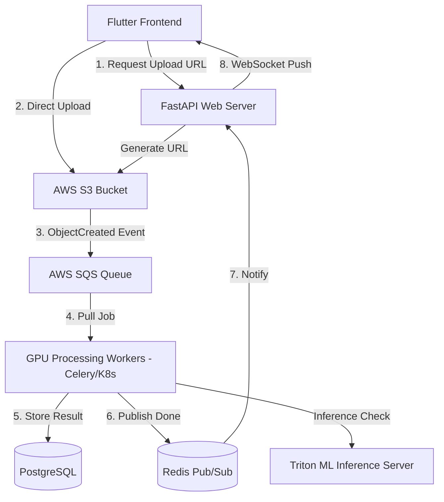

# 🚀 BACKEND WORLD-CLASS BLUEPRINT: PenaltyIQ CTO Master Plan

As a Principal Architect and CTO, looking at the current PenaltyIQ codebase, I see a brilliant, scientifically sound prototype. The math is right. The logic is clean. But if we push this to production tomorrow and a viral TikTok sends 10,000 users to the app, **the servers will immediately ignite and crash.** 

Right now, the API layer and the deep-learning/math layer are stuffed into the same box. This document dictates exactly how we shatter this monolith into a hyper-scalable, enterprise-grade machine learning ecosystem ready for millions of kicks.

---

## 1. 🔍 Critical Gaps Analysis (Brutally Honest)

* **The Web Server is the CPU Bottleneck:** You are running BGR frame processing and MediaPipe on the FastAPI web server. Even wrapped in threads, when 5 people upload videos, the CPU spikes to 100%, causing HTTP requests to drop for everyone else. 
* **The Upload Pipeline is Dangerous:** Handling 100MB MP4 streams directly in FastAPI RAM/Disk is a disaster. It exhausts memory and chokes network I/O.
* **No Database = No AI Future:** Because there’s no persistence, we are throwing away the most valuable asset: data. We need to store every single angle trajectory to build our future proprietary ML coaching models.
* **Rule-Based Engine Limits:** The current coaching engine is hardcoded (`if knee_angle < 30`). This doesn't account for complex, sequenced, multi-joint dynamic movements. It needs to transition to a true ML model.

---

## 2. 🏗 Production Architecture Redesign

We are moving to an **Event-Driven, Decoupled Microservices Architecture**.

### The Flow
1. **Frontend** asks API for an S3 Presigned URL.
2. **Frontend** uploads video *directly* to AWS S3 (bypassing our API entirely).
3. **S3** triggers an event to **AWS SQS** (Queue).
4. **GPU Worker Nodes** pick up the message, download the video, and run Pose/Physics math.
5. **Worker** writes results to **PostgreSQL** and publishes a result event to **Redis Pub/Sub**.
6. **API** reads the result and streams it down to the frontend via **WebSockets**.

### Architecture Diagram

---

## 3. 🚀 Scalability Plan

* **10 Users:** A single monolithic server works.
* **100 Users:** Decouple into 1 API instance + 2 Worker instances.
* **10,000 Users (Viral Load):** 
  * The API scales horizontally (CPU-light) behind an AWS Application Load Balancer. It handles millions of WebSocket connections easily.
  * The **Workers** are placed in an AWS Auto-Scaling Group (or K8s HPA) tied to the `SQS Queue Depth`. If there are 500 videos waiting, AWS spins up 50 GPU instances instantly. When the queue hits 0, it spins them down to save money.

---

## 4. 🧠 The True Machine Learning Pipeline

Our goal is to replace the hardcoded "IK Solver + Rules" with a **Proprietary Biomechanical Foundation Model**.

* **Dataset Generation:** Every processed kick (X,Y time-series of 33 joints, output velocity, goal zone) is saved to an S3 Data Lake. 
* **Feature Engineering:** We don't just use raw X, Y. We extract dynamic features: "Angular Velocity of the Knee", "Hip-to-Shoulder Separation Angle", "Foot Speed at Impact".
* **The Model (Sequence Classification):** We treat a kick as a time-series sequence. We train a **Temporal Convolutional Network (TCN) or a lightweight Transformer**. 
* **Output:** Instead of hardcoded rules, the ML model predicts the *probability of failure based on the sequence* and uses SHAP values / Attention Weights to identify *exactly which joint at which millisecond* ruined the kick.
* **Deployment:** Containerize the ML model using **NVIDIA Triton server** to serve inferences via gRPC inside our private VPC to the processing workers.

---

## 5. 🔗 Backend ↔ ML Integration

* **Where it sits:** After `PoseEstimator` gets the joints, the trajectory data array is sent via gRPC to the internal ML Microservice. 
* **Fallback Strategy:** If the Triton ML Server is overloaded or crashes, the Worker catches the exception and falls back to the deterministic IK Solver / Rule-based coaching engine currently in the code.

---

## 6. 🗄 Data Architecture

We use **PostgreSQL** for relational metadata and **AWS S3** for heavy binary/JSON tracking data.

**Tables:**
* `users` (uuid, email, sub_tier, created_at)
* `sessions` (uuid, user_id, environment_params)
* `kicks` (uuid, session_id, video_s3_key, status (`PROCESSING`, `COMPLETED`, `FAILED`))
* `kick_results` (uuid, kick_id, ball_velocity, strike_zone, overall_score)
* `coaching_insights` (uuid, kick_id, generated_cue, severity)

*Note: The raw 30fps X,Y landmark tracking data (megabytes of JSON) should NOT live in Postgres. Store it in S3 as `.parquet` files, referencing the URI in the `kick_results` table.*

---

## 7. ⚡ Performance Optimization Plan

1. **TensorRT Optimization:** Currently relying on CPU MediaPipe. We must switch to GPU-accelerated ONNX/TensorRT models for pose estimation.
2. **Frame Pruning:** Do NOT analyze 10 seconds of 60fps video. Run a lightweight motion-detection heuristic to find the 1.5 seconds of actual swing/follow-through and discard the rest *before* running expensive Pose ML.
3. **RAM Management:** Process videos optimally using generators. Never load standard BGR frames into RAM globally. 

---

## 8. 🔐 Security Hardening

1. **Authentication:** Integrate **JWT/OAuth2** via Supabase, Auth0, or Firebase. 
2. **Pre-Signed URLs:** API only issues S3 URLs with strict 2-minute expiries and 50MB file size caps to prevent Storage DDoS.
3. **API Rate Limiting:** Redis-backed rate limiter on the Gateway. Max 5 analysis requests per user per minute.

---

## 9. 🧪 Testing Strategy

* **Unit Tests (Pytest):** Test the math purely. Feed synthetic parabolic data into the Physics Engine and assert the output $v_0$ is exact. 
* **Integration Tests:** Automate a T-pose and kick pipeline upload against a staging environment.
* **Load Testing:** Use Locust/K6 to simulate 500 concurrent connections uploading 10MB test binaries to see when the queue clogs.

---

## 10. 📊 Observability System

If we can't see the system, we can't fix it.
* **Logging:** Use `structlog` to output JSON logs. Ship logs to **Datadog or ELK (Elasticsearch, Logstash, Kibana)**. 
* **Metrics:** Instrument the Python workers to push metrics to **Prometheus**:
  * `worker_processing_time_seconds`
  * `pose_extraction_confidence_score`
* **Dashboards (Grafana):** CTO dashboard showing Queue Size, Processing Latency (P95), and Error Rates in real-time.

---

## 11. 🚀 Deployment Plan

* **Infrastructure as Code:** Write everything in **Terraform / AWS CDK**.
* **Docker Strategy:** 
  * Image A: FastAPI lightweight web container.
  * Image B: Heavy Celery/CUDA Worker container containing OpenCV/ML libraries.
* **Cloud Architecture:** AWS Elastic Kubernetes Service (EKS) or ECS.
* **CI/CD Pipeline (GitHub Actions):** 
  * Push to `main` $\rightarrow$ Run Pytest $\rightarrow$ Build Docker $\rightarrow$ Push to AWS ECR $\rightarrow$ Rolling update EKS pods.

---

## 12. 💣 Failure Scenarios & Recovery

* **Video Processing Fails (Corrupt File):** Worker catches the error, sets DB status to `FAILED`, and sends a WebSocket message to the client prompting a re-upload. Original message in SQS is deleted.
* **Worker Crash (OOM):** SQS visibility timeout expires. The message reappears in the queue and is picked up by a different healthy worker.
* **ML Model Crashes:** Switch to mathematical IK fallback rules instantly. Page the engineering team via PagerDuty.

---

## 13. 🧠 Roadmap to a Billion-Dollar Product

* **Phase 1: Enterprise MVP (Months 1-3):** Implement SQS queues, PostgreSQL, and basic JWT Auth. Fix the system so it doesn't crash under load.
* **Phase 2: Scale & Monetization (Months 4-6):** Build the GraphQL/REST data layers for leaderboards, user histories, and sharing. Optimize GPU compute to reduce AWS bills.
* **Phase 3: AI Dominance (Months 7-12):** Harvest the 500,000 kick trajectories stored in S3. Train proprietary Temporal Convolutional Models. Transition from "Math-based coaching" to "True AI-derived biomechanical optimization" matching professional elite athletes.

---

# 🎁 BONUS: "If I Had 30 Days to Make This World-Class"

**Week 1: The Decoupling**
* **Day 1-2:** Strip the video upload logic out of FastAPI. Create AWS S3 infrastructure and presigned URL generation endpoints.
* **Day 3-5:** Setup RabbitMQ/Redis (local) and SQS (cloud). Extract the core analysis logic into a standalone Celery Worker file `worker.py`. 

**Week 2: Data & Persistence**
* **Day 6-8:** Spin up PostgreSQL (RDS). Write SQLAlchemy models for Users, Sessions, and Kicks. 
* **Day 9-10:** Update the Worker to write results into the database upon completion rather than returning a sync JSON.

**Week 3: Real-time Comms & Hardening**
* **Day 11-14:** Implement FastAPI WebSockets for the client to receive the "Processing Complete" push.
* **Day 15-17:** Implement JWT Authentication middleware and basic Rate Limiting via Redis.

**Week 4: Cloud & Deployment Strategy**
* **Day 18-21:** Containerize the API and the Worker separately. Write the Terraform scripts for VPC, EKS, RDS, and S3.
* **Day 22-25:** Set up GitHub Actions CI/CD. 
* **Day 26-28:** Integrate Prometheus/Grafana monitoring to watch the queue lengths.
* **Day 29-30:** Load Test with K6. Fix memory leaks. Launch exactly on Day.